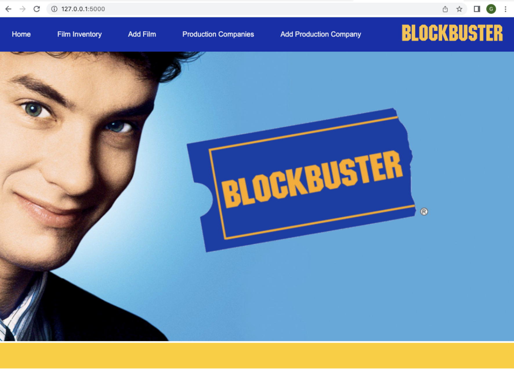

# Blockbuster Shop Flask App 

[](https://www.python.org/downloads/release/python-390/)


## Quick Start

_Ensure you have [Docker installed](https://docs.docker.com/get-docker/) and running on your machine._

```
docker run -p 5000:5000 --name blockbuster_app cleobrown/blockbuster
```
App should be running on [localhost:5000](http://localhost:5000)<br>

---

## Project Brief: Shop Inventory <br>
Build an app which allows a shopkeeper to track their shop's inventory. This is not an app which the customer will see, it is an admin/management app for the shop workers.


- The inventory should track individual products, including a name, description, stock quantity, buying cost, and selling price.
- The inventory should track manufacturers, including a name and any other appropriate details.
- The shop can sell anything you like, but you should be able to create and edit manufacturers and products separately.
- This might mean that it makes more sense for a car shop to track makes and models of cars. Or a bookstore might sell books by author, or by publisher, and not by manufacturer. You are free to name classes and tables as appropriate to your project.
- Show an inventory page, listing all the details for all the products in stock in a single view.
- As well as showing stock quantity as a number, the app should visually highlight "low stock" and "out of stock" items to the user.


## Technologies<br>

- HTML / CSS<br>
- Python<br>
- Flask<br>
- SQLite3<br>

## Run with Docker - build locally

_Ensure you have [Docker installed](https://docs.docker.com/get-docker/) and running on your machine._

To build the image locally, cd into this project root directory and run:

```
docker build -t blockbuster .
```

Then to run:

```
docker run -p 5000:5000 --name blockbuster_app blockbuster
```

App should be running on [localhost:5000](http://localhost:5000)<br>

To stop the container:

```
docker stop blockbuster_app
```

## Alternative manual steps to run
- Create the database<br>
<br>Run:

(The below command must be run first to ensure the database tables are created and the primary keys are reset to 1. The database primary keys are set to match the picture file names).
```
sqlite3 db/product_manager.db < db/product_manager.sql
```

- Insert data from console.py file<br>
<br>Run:
```
python console.py
```

- Start server<br>
<br>Run:
```
flask run
```
  App should be running on [localhost:5000](http://localhost:5000)<br>

